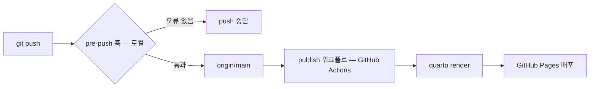

# 한 줄

**한국어 연구 노트를 Quarto 로 GitHub Pages 에 발행하는 사이트, 그리고 발행된 글이
자기 근거에서 벗어나면 push 를 막는 장치들.**

애플리케이션이 아니다. 서버도, 루트 의존성 매니페스트도 없다 — `package.json` ·
`pyproject.toml` · `requirements.txt` 어느 것도 루트에 없다. **매니페스트로 이 레포를
파악하려 하면 아무것도 안 나온다.** 진입점은 `_quarto.yml` 하나이고, 나머지 엔지니어링은
전부 검사 쪽에 있다.

# 푸시 하나에 무슨 일이 일어나나



★ **두 파이프라인은 서로 모른다.** 왼쪽은 로컬에서만 돌고 push 를 거부할 수 있다.
오른쪽은 CI 에서 돌지만 **렌더하고 배포할 뿐 아무것도 검증하지 않는다.**

그래서 결론이 하나 나온다 — **편집 정합성을 지키는 것은 전부 로컬 훅이고, 그 훅은
켜야 켜진다.** 자세한 것은 [푸시 게이트](editorial-guards/push-gate.md).

세 번째 워크플로가 하나 더 있다. **이 위키를 매일 다시 만들어 PR 을 여는 예약
작업**이고, 공급자 API 키 시크릿과 쓰기 권한을 요구한다. 시크릿이 없으면 매일 실패한다.

# 어디를 열어야 하나

| 하려는 일 | 페이지 | 코드 |
|---|---|---|
| 새 글을 발행 대상에 넣는다 | [사이트 빌드](publishing/site-build.md) | `_quarto.yml` |
| 글 갈래를 고른다 · 템플릿을 쓴다 | [콘텐츠 갈래](publishing/content-tracks.md) | `_templates/` |
| 용어를 등록한다 · 앵커를 옮긴다 | [용어집](publishing/glossary.md) | `glossary.qmd` |
| push 가 막혔다 | [사이트 린트](editorial-guards/site-lint.md) | `_tools/site_lint.py` |
| 갱신일이 이상하다 | [날짜 파생](editorial-guards/date-provenance.md) | `_tools/sync_dates.py` |
| 검사가 도는지 확인한다 | [푸시 게이트](editorial-guards/push-gate.md) | `.githooks/pre-push` |
| 개념 카드를 더한다 | [지식 번들](knowledge-bundle/okf-bundle.md) | `knowledge/` |
| 번들이 빨개졌다 | [번들 적합성 검사기](knowledge-bundle/conformance-checker.md) | `tests/` |
| 그림을 새로 그린다 | [그림 생성](evidence/figure-generation.md) | `_tools/figures/` |
| 통계 논증을 재현한다 | [재현 스크립트](evidence/reproduction-scripts.md) | `_tools/stats/` |
| 지도 수치의 출처를 확인한다 | [분야 지도 코퍼스](evidence/field-map-corpus.md) | `_data/field-map-corpus/` |
| 왜 이렇게 정했는지 찾는다 | [결정 기록](governance/decision-records.md) | `docs/adr/` |
| 내부 용어의 뜻을 찾는다 | [내부 어휘](governance/vocabulary.md) | `CONTEXT.md` |
| 이슈·라벨 규약을 본다 | [에이전트 배선](governance/agent-instructions.md) | `docs/agents/` |
| 밖에 의존하는 자리를 본다 | [레포 밖 경계](governance/cross-repo-boundaries.md) | — |

# 좁은 확인 명령

```bash
git config --get core.hooksPath          # .githooks 가 나와야 게이트가 산다
python3 _tools/site_lint.py              # 발행 정합성
python3 tests/check_knowledge_bundle.py --selftest   # 검사가 빨개지긴 하나
python3 _tools/sync_dates.py --check     # 갱신일이 최신인가
quarto render                            # 전체 렌더
```

# 처음 읽는 사람이 자주 틀리는 것

- **초록이 최신을 뜻하지 않는다.** 번들 검사는 형식만 보고, 카드가 0장이어도 통과한다
- **0건은 결론이 아니다.** 이 레포의 검사 여럿이 대상을 잃으면 빨개지지 않고 조용히
  꺼진다. 양성 대조 없이 나온 0건은 신호다
- **클론은 작업 사본보다 작다.** 운영 규칙 원문·논문 노트·작업 폴더가 전부 git 밖이다
- **검사 하나는 옆 디렉터리에 다른 레포가 있어야 돈다.** 없으면 조용히 건너뛴다 —
  그리고 **지금은 있는데도 0건을 대조하고 있다**(아래 백로그)
- **발행되는 것이 전부 검사받지는 않는다.** 노트북은 배포되지만 린트 대상이 아니다

# 백로그 — 확인됐고 안 고친 것

이 위키는 문서 전용 실행이라 소스를 고치지 않았다. 아래는 생성 중에 실측으로 확인된
불일치다.

- ★ **점수 대조 검사가 지금 0건을 대조한다.** 형제 레포는 옆에 있는데 그 README 에
  검사가 찾는 헤더 문자열이 없어서, 검사는 실행되고 비교를 한 번도 하지 않고 통과한다
  ([레포 밖 경계](governance/cross-repo-boundaries.md))
- ★ **발행되는 노트북이 린트 대상이 아니다.** 검사 대상 glob 이 `.qmd` 만 잡는다
  ([사이트 린트](editorial-guards/site-lint.md))
- **번들 색인의 frontmatter 가 깨지면 개수 하한이 조용히 사라진다.** 색인은 예약
  이름이라 카드 검증에서 빠지고, 하한 읽기는 파싱 실패를 삼킨다
  ([번들 적합성 검사기](knowledge-bundle/conformance-checker.md))
- **`README.md` 가 없는 최상위 파일을 소개한다.** 그 페이지는 프롤로그에 흡수됐고
  리다이렉트만 남아 주소를 지킨다. `_tools/make_field_map_charts.py` 머리말도 같은
  죽은 이름을 가리킨다
- **`docs/agents/domain.md` 가 `CONTEXT.md` 를 "아직 없다" 고 적는다.** 파일은 루트에
  실재한다 — ADR 0003 이 만들면서 안내 문서를 같이 안 고쳤다
- **`tests/okf_document.py` 가 이 레포에 없는 ADR 경로를 인용한다.** 산문이라 어떤
  검사도 빨개지지 않는다
- **`.openwikiignore` 가 자기 자신을 못 읽게 막고 있었다.** 이번 실행 중에 되살렸으나
  읽기 경계는 실행 시작 시점에 고정되므로 **다음 실행부터 적용된다**
