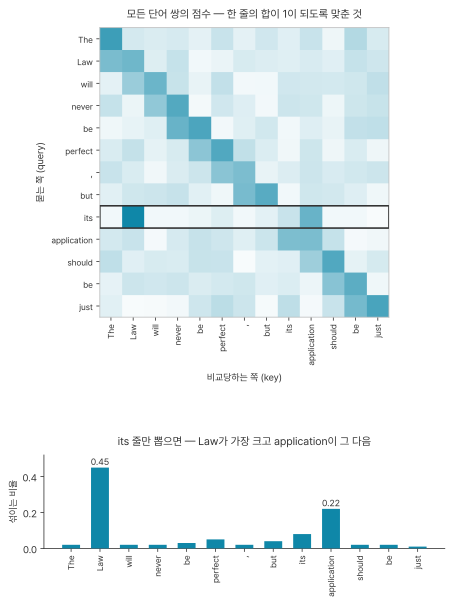
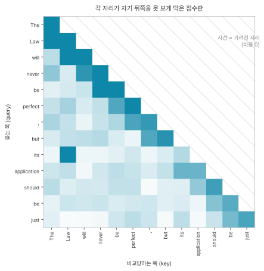
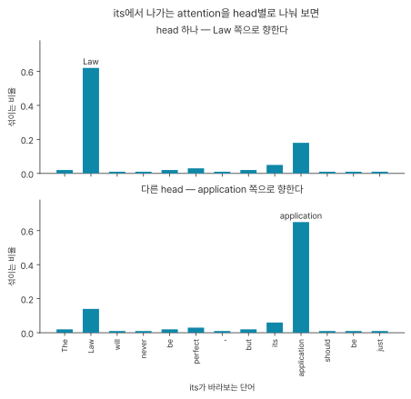

> *Attention Is All You Need* · arXiv: [1706.03762](https://arxiv.org/abs/1706.03762) · Ashish Vaswani 외 7인 (Google Brain · Google Research · Univ. of Toronto) · **NIPS 2017** — 저자 전원이 동등 기여이고 나열 순서는 무작위라고 논문이 밝힌다. 읽은 판은 arXiv v7(2023-08-02).\
> 상태: 본문 전편과 부록 정독.

## 필요한 건 attention뿐이다

이 논문을 한 문장으로 줄이면.

> 문장을 앞에서 뒤로 한 단어씩 읽던 방식을 버리고, 모든 단어가 서로를 한 번에 쳐다보는 방식으로 바꿨다.

**Attention Is All You Need.** 필요한 것은 attention뿐이라는 뜻이고, 저자들이 초록에 쓴 문장이 이것이다.

> We propose a new simple network architecture, the Transformer, based solely on attention mechanisms, dispensing with recurrence and convolutions entirely.
>
> attention 장치만으로 이루어진 새 구조 Transformer를 제안한다. recurrence와 convolution은 완전히 걷어냈다.

이 논문의 제목은 **무엇을 뺐는지를 가리킨다.** 걷어낸 두 방식이 무엇인지는 아래에서 하나씩 설명한다.

지금 쓰는 대형 언어모델 대부분이 이 구조를 기반으로 만들어졌다. 우리가 챗봇으로 쓰는 GPT가 그 예이고, 그 이름에 든 T가 여기서 온 Transformer다. 다만 이 논문이 만든 것은 언어모델이 아니라 번역기이고 성능도 번역 점수로 보고한다.

## 전체 구조

문장이 들어가서 단어가 나올 때까지 다섯 걸음이다.

```
1. 문장이 들어온다        The Law will never be perfect, but its application should be just
2. 단어를 숫자로 바꾼다     + 몇 번째 단어인지 순서도 같이 표시한다
3. 서로 쳐다보고 섞는다     ← attention. 이것을 여섯 번 반복한다
4. 다음 단어 하나를 고른다
5. 그 단어를 뒤에 붙이고 1번으로 돌아간다
```

3번이 이 논문이 말하는 핵심적인 부분이다.

조립된 모습은 이렇게 생겼다. 그림 안의 낯선 말들은 아래에서 하나씩 설명한다.

```{mermaid}
flowchart LR
    IN["<b>읽을 문장</b><br/>The Law will never…"] --> EMB["임베딩<br/>+ 위치 정보"]
    EMB --> ENC["<b>encoder</b> 층 6개<br/>입력 단어끼리 보기"]
    ENC --> DEC["<b>decoder</b> 층 6개<br/>앞서 쓴 단어끼리 보기<br/>encoder 결과 보기"]
    OUT["<b>지금까지 쓴 출력</b>"] --> OEMB["임베딩<br/>+ 위치 정보"]
    OEMB --> DEC
    DEC --> HEAD["어휘 전체에<br/>대한 확률"] --> WORD["다음 단어 하나"]
```

위쪽 줄기가 읽는 쪽이고 아래쪽 줄기가 쓰는 쪽이다. 둘이 만나는 자리에서 읽은 결과가 쓰는 쪽으로 건너간다. 이 두 덩어리의 이름이 [encoder와 decoder](../glossary.qmd#encoder-decoder)(부호화기·복호화기)이다. 읽을 문장과 쓸 문장이 서로 다른 문장이라 읽는 일과 쓰는 일을 나눈다. 오른쪽 끝의 어휘는 이 모델이 다룰 수 있는 단어 전체 목록을 말한다.

오른쪽 끝에서 나온 단어는 아래 줄기의 출력 자리에 다시 붙는다. 그렇게 전체를 다시 돌려 그다음 단어를 만드는 방식을 [auto-regressive](../glossary.qmd#training-inference)(자기회귀)라 부른다. 끝말잇기를 혼자 하는 셈이라 글이 길어질수록 매번 계산 부담이 늘어난다.

### 부품은 여섯 개다

| 부품 | 하는 일 | 없으면 무엇이 안 되나 |
|---|---|---|
| 임베딩 | 단어를 숫자 묶음으로 바꾼다 | 기계는 숫자만 받는다 |
| 위치 표시 | 몇 번째 단어인지 알려준다 | 단어 순서를 구분하지 못한다 |
| attention | 각 단어가 나머지를 전부 훑어보고 관련 있는 것을 섞어 넣는다 | 단어가 문맥을 얻지 못한다 |
| 피드포워드 신경망 | 섞은 결과를 단어마다 따로 한 번 더 가공한다 | attention은 섞기만 한다 |
| 잔차 연결 + 정규화 | 원래 값을 결과에 다시 더하고 숫자 크기를 매번 같은 규격으로 되돌린다 | 층을 여섯 개 쌓으면 무너진다 |
| 마스킹 | 쓰는 쪽이 정답을 미리 못 보게 가린다 | 정답을 베껴서 아무것도 배우지 않는다 |

### 층 하나의 구성

attention과 피드포워드 한 세트다. 앞은 단어들 사이를 오가고 뒤는 단어 하나 안에서만 일어난다. 다 같이 모여 섞은 다음 각자 자기 것만 갖고 가공하는 셈이다.

```
층 하나  =  [ 다 같이 섞는다 ]  →  [ 각자 혼자 가공한다 ]
               attention              피드포워드
               옆을 본다              옆을 안 본다
```

이 층을 여섯 번 쌓는다. 한 번 섞으면 직접 이웃까지 닿고, 여섯 번 섞으면 정보가 문장 안을 몇 다리 건너 퍼진다. 논문은 이 구조를 `a stack of N = 6 identical layers`(동일한 층 6개를 쌓은 것)라고 적는다. 층을 쌓는다는 말이 논문 표현의 직역이고, 깊게 쌓아 쓰는 방식을 딥러닝(deep learning)이라 부른다. 딥러닝의 deep이 곧 층이 많다는 뜻이다.

논문은 층 안쪽의 부품 하나하나를 하위층(sub-layer)이라 부르고, 이때 층은 [행렬 하나를 층이라 부른 것](before-attention.qmd#층을-쌓아도-그대로다)보다 큰 단위다. decoder 층에는 부품이 하나 더 붙어 셋이다. 자기 문장을 보는 attention, encoder가 내놓은 결과를 보는 attention, 그리고 피드포워드 신경망이다. 위 그림에서 decoder만 화살표를 두 방향으로 받는 것이 이 차이다.

층은 양쪽 다 여섯 개이고, 층마다 새로 설계한 게 아니라 같은 모양을 여섯 번 복사해 쌓았다. 계산 구조는 같고 [파라미터](../glossary.qmd#parameter) 값만 층마다 따로 학습된다. 파라미터는 계산식 안에서 학습이 값을 정하는 자리이고, [학습은 그 값을 틀린 정도가 줄어드는 쪽으로 조금씩 옮기는 절차다](before-attention.qmd#정리하면-다섯-줄).

그리고 모델 안을 도는 벡터는 전부 512차원으로 통일돼 있다. 차원이 같아야 층을 계속 쌓고 부품을 갈아 끼울 수 있다. 이 512는 논문의 두 설정 중 작은 쪽 값이다. 저자들은 같은 구조로 크기만 키운 설정도 같이 돌렸고, 작은 쪽이 파라미터 6,500만 개, 큰 쪽이 2억 1,300만 개다. 논문이 내세운 최고 점수는 큰 쪽에서 나왔다. 앞으로 나오는 수치는 작은 쪽 것이다.

## 한 단어씩 읽던 방식 - RNN

2017년까지의 표준 답은 [RNN](../glossary.qmd#rnn)(recurrent neural network, 순환 신경망)이었다. 문장을 앞에서 뒤로 한 단어씩 읽으면서 지금까지의 요약을 하나 들고 다닌다.

> Aligning the positions to steps in computation time, they generate a sequence of hidden states h_t, as a function of the previous hidden state h_{t−1} and the input for position t.
>
> 위치를 계산 시간의 단계에 맞춰서, 직전 은닉 상태 h_{t−1}과 t번째 위치의 입력을 재료로 은닉 상태 h_t를 만들어낸다.

`h_t`가 그 요약이고 정식 이름은 [은닉 상태](../glossary.qmd#hidden-state)(hidden state)다. 아래첨자 `t`는 몇 번째 단어인지를 가리킨다. 이 글이 쓸 예문을 이 방식으로 읽으면 이렇게 간다.

```
"The"      + (없음)  →  h₁
"Law"      + h₁      →  h₂     ← Law 가 여기 들어갔다
"will"     + h₂      →  h₃
"never"    + h₃      →  h₄
```

이 방식이 치르는 대가가 둘이다.

- **순서대로만 갈 수 있다** — h₃이 나오기 전에는 h₄를 시작할 수 없다. 100단어 문장이면 100번을 줄줄이 기다린다. GPU는 계산 수천 개를 한꺼번에 처리하는 장비인데 이 구조에서는 그 능력이 놀게 된다.
- **멀리 있는 단어일수록 흐려진다** — 은닉 상태는 한 덩어리뿐이고 새 단어가 들어올 때마다 그 위에 덮어쓴다. 되돌아가서 앞 단어를 다시 볼 방법이 없다. 여덟 번째 단어를 처리할 때 손에 든 것은 앞의 일곱 단어가 전부 뭉개진 은닉 상태 하나이고, 그 안에 특정 단어가 얼마나 남아 있는지는 보장되지 않는다.

논문은 이 문제를 경로 길이로 표현한다. 두 단어가 서로에게 영향을 주려면 신호가 몇 단계를 거쳐야 하는가다.

> The shorter these paths between any combination of positions in the input and output sequences, the easier it is to learn long-range dependencies.
>
> 입력과 출력의 어떤 위치 조합 사이든 이 경로가 짧을수록 장거리 의존 관계를 배우기 쉽다.

두 방식의 차이가 여기서 갈린다.

```{mermaid}
flowchart TB
    subgraph R["한 단어씩 읽기(RNN)"]
    direction LR
    r1["Law"] --> r2["will"] --> r3["never"] --> r4["be"] --> r5["…"] --> r6["its"]
    end
    subgraph A["attention"]
    direction LR
    a1["Law"] --> a6["its"]
    end
    R ~~~ A
```

| 방식 | 두 단어를 잇는 데 걸리는 단계 | 동시에 계산할 수 있나 |
|---|---|---|
| 한 단어씩 읽기(RNN) | 떨어진 거리만큼 | 못 한다 |
| attention | 몇 칸 떨어져 있든 항상 1 | 한다 |

하지만 한 단어씩 읽는 방식은 순서를 지키지 않으면 계산 자체가 성립하지 않으므로 순서 정보가 공짜로 딸려온다. attention은 순서 정보를 따로 처리를 해주어야한다. 어떻게 처리하는지는 아래에서 설명한다.

## 정적 임베딩과 문맥 임베딩

기계는 숫자만 먹으니 단어를 벡터로 바꿔서 넣는다. 이 묶음이 [임베딩](../glossary.qmd#embedding)이고 뜻이 비슷한 단어끼리 좌표가 가깝게 놓인다. 그 좌표는 사람이 채우는 게 아니라 [빈칸 맞히기를 시키면 저절로 그렇게 밀린다](before-attention.qmd#빈칸-맞히기가-뜻을-만드는-과정).

> The Law will never be perfect, but its application should be just
>
> 법은 결코 완벽할 수 없지만 그 적용은 정의로워야 한다

`its`가 무엇을 가리키는가. `Law`인가 `application`인가. 사람은 법의 적용으로 읽지만 기계에게는 후보가 둘이다.

초기 방식에서는 이 구분이 불가능했다. 단어 하나에 벡터 하나가 고정으로 배정되기 때문이다. 그 방식의 대표가 word2vec이고, 단어마다 벡터를 하나씩 만들어 사전처럼 들고 다니는 방법이다. Jurafsky & Martin의 [*Speech and Language Processing*](https://web.stanford.edu/~jurafsky/slp3/)(SLP) 3판은 이렇게 설명한다.

> for word2vec and other static embeddings, the representation of a word's meaning is always the same vector irrespective of the context
>
> word2vec을 비롯한 정적 임베딩에서 단어 의미의 표현은 문맥과 무관하게 항상 같은 벡터다

여기서 표현은 그 단어를 나타내는 벡터를 말한다. `its`의 벡터가 늘 똑같으면 이 문장의 `its`와 다른 문장의 `its`를 구분할 데가 없다. [정적 임베딩](../glossary.qmd#static-contextual-embedding)(static embedding)이라는 이름이 그 뜻이다.

필요한 것은 문맥에 따라 달라지는 표현이고 그 이름이 문맥 임베딩(contextual embedding)이다. 트랜스포머가 하는 일이 정확히 이것이다. 층을 지날 때마다 각 단어의 표현에 주변 단어의 정보를 섞어 점점 문맥이 반영된 표현을 만든다.

문제는 이 주변이 바로 옆이 아니라는 점이다. 예문에서 세어보면 이렇다.

```
The  Law  will  never  be  perfect  ,  but  its  application  should  be  just
 1    2     3     4     5     6     7   8    9      10         11    12   13
      └────────────── 일곱 칸 ──────────────┘
```

`its`가 답을 얻으려면 일곱 칸 앞의 `Law`에 닿아야 한다. 더 긴 글에서는 몇 문단 앞일 수도 있다. 멀리 있는 단어를 어떻게 끌어오느냐가 이 분야의 오래된 숙제였다.

### 학습이 정하는 것과 매번 계산되는 것

여기서 갈라둘 것이 있다. 문맥이 섞인 `Law`는 어딘가에 저장돼 있는 값이 아니다.

저장할 수가 없다. 문장은 무한히 만들 수 있으므로 모든 문장의 모든 `Law`를 미리 계산해두는 것은 불가능하다.

```
"The Law will never be perfect"     →  이 Law 의 벡터
"He broke the law last night"       →  이 law 의 벡터        서로 다르다
```

그러면 학습으로 굳는 것은 무엇인가. **섞는 방법이다.**

| | 무엇이 정해지나 | 언제 |
|---|---|---|
| 학습 | 어떤 단어를 얼마나 섞을지 판단하는 기준 | 훈련 때. 끝나면 안 변한다 |
| 계산 | 그 기준으로 이 문장의 이 단어를 실제로 만든다 | 문장이 들어올 때마다 새로 |

[택시 요금표로 보면](before-attention.qmd#기계는-이-값을-어떻게-찾나) `3,000 + 1,000 × 거리`라는 식이 학습으로 굳은 것이고, 손님마다 나오는 요금은 매번 새로 계산된다. 요금을 미리 저장해두는 것이 아니다. 문맥이 섞인 벡터는 요금 쪽이다.

계산식이 단어마다 따로 있는 것도 아니다. 논문이 피드포워드 신경망을 두고 적은 문장이 그 성질을 밝힌다.

> which is applied to each position separately and identically… While the linear transformations are the same across different positions, they use different parameters from layer to layer.
>
> 위치마다 따로, 그리고 똑같이 적용된다. 계산식은 위치가 달라도 같지만 층이 달라지면 파라미터가 다르다.

한 층 안에서는 모든 단어가 같은 계산식을 통과하고, 층이 바뀌면 계산식이 달라진다. 단어마다 다른 결과가 나오는 이유는 계산식이 달라서가 아니라 들어가는 값이 달라서다. 그래서 문장이 몇 단어이든 같은 계산식으로 처리할 수 있다.

## attention의 계산 세 걸음

은닉 상태를 만들지 않는 것이 해법이다. 읽은 단어를 전부 그대로 펼쳐두고 필요할 때마다 골라 본다. 다만 기계는 이게 중요해 보인다는 감을 쓸 수 없으니 숫자로 점수를 매겨야 한다.

가장 단순한 형태부터 보면 계산이 세 줄이다.

```
1. 지금 단어와 다른 단어들이 얼마나 비슷한지 점수를 낸다
2. 그 점수를 합이 1인 비율로 바꾼다
3. 그 비율대로 다른 단어들을 섞어서 지금 단어의 새 표현을 만든다
```

이 세 줄 전체가 attention이다. 각 단어가 문장의 어느 쪽을 얼마나 볼지를 숫자로 정하는 일을 가리킨다.

비슷한 정도는 두 벡터의 내적으로 측정한다. 두 벡터의 같은 자리끼리 곱해서 전부 더하는 계산이다.

```
바나나  [ 2.0,  9.0,  1.0 ]
사과    [ 1.5,  2.0,  1.0 ]
        ────────────────────
내적 =  2.0×1.5 + 9.0×2.0 + 1.0×1.0  =  22
```

한쪽이 큰 자리에서 다른 쪽도 크면 곱이 커진다. 두 단어가 같은 차원에서 같이 크다는 것은 그 성질을 함께 가졌다는 뜻이라, 값이 클수록 닮았다는 신호가 된다. 다만 이 값은 두 벡터의 숫자가 전반적으로 크기만 해도 같이 커진다. 닮은 정도만이 아니라 숫자의 크기에도 반응한다는 뜻이다.

이 계산을 모든 단어 쌍에 돌린다. 한 단어만이 아니라 문장의 모든 단어가 모든 단어와 짝지어 계산된다. 13단어 문장이면 13 × 13이다. 그 결과가 attention 점수 표 한 장이고, 가로줄은 지금 처리 중인 단어, 세로줄은 비교당하는 단어다. 칸 하나가 그 둘 사이의 점수다.

{fig-alt="예문 13단어의 모든 쌍을 표로 그린 점수 표와, 그중 its 줄만 막대로 뽑아 Law 0.45·application 0.22를 표시한 그림"}

### 후보 전부를 비율대로 합친다

`its` 줄만 떼어 보면 `Law`가 0.45, `application`이 0.22쯤 되는 식이다. 여기서 다음 걸음이 이 장치의 목적이다.

**attention은 후보 전부에 비율을 매기고 그 비율대로 전부 섞어서 새 벡터 하나를 만든다.**

```
its 가 각 단어에 매긴 비율

  Law           0.45
  application   0.22
  perfect       0.11
  will          0.05
  나머지 전부    …      ← 작지만 0이 아니다
  ─────────────────
  전부 더하면    1.00
```

`Law`가 제일 많이 들어오지만 `application`도 들어오고 나머지도 조금씩 들어온다. 유사도로 순위를 매긴 다음 위에서 몇 개를 골라내고 나머지를 버리는 방식과 여기서 갈린다. 나오는 것도 단어 여러 개가 아니라 벡터 하나다.

정답의 단서가 한 단어에만 있는 것이 아니기 때문이다. `its`가 `Law`를 가리킨다는 판단에는 `application`도 `perfect`도 조금씩 기여한다. 하나만 남기고 버리면 그 정보가 사라진다.

섞는다는 것이 실제로 무슨 계산인지는 숫자를 넷으로 줄인 축소판으로 보면 드러난다.

```
Law          [ 8,  2,  1,  0 ]
its          [ 1,  1,  5,  3 ]
application  [ 6,  3,  2,  1 ]

비율          Law 0.6      its 0.3      application 0.1

첫 칸만 계산하면    0.6 × 8  +  0.3 × 1  +  0.1 × 6  =  5.7

원래 its   [  1  ,  1  ,  5  ,  3  ]
새 its     [ 5.7 , 1.8 , 2.3 , 1.0 ]
```

첫 칸이 1에서 5.7로 뛰었다. `Law`의 첫 칸이 8인데 그것을 0.6만큼 가져왔기 때문이다. `its`의 숫자가 `Law`를 닮아간 것이고 이것이 문맥이 반영된다는 말의 실체다. 비율이 `Law 0.1`로 줄면 반대가 된다. 그래서 앞의 두 걸음(점수 내기·비율로 바꾸기)이 하는 일은 얼마나 가져올지를 정하는 것이다.

2번에서 점수를 비율로 바꾸는 계산의 이름이 softmax다. 점수를 그대로 곱해서 더하면 단어가 많은 문장일수록 결과가 계속 커지는데, 합이 1인 비율로 바꿔놓으면 섞은 결과가 원래 벡터들의 평균 자리에 머물러 크기가 안 튄다.

softmax는 개수를 바꾸지 않는다. 점수 열세 개가 들어가면 비율 열세 개가 나오고 합만 1이 된다.

```
점수  [ 3.0, 2.0, 1.0 ]   →  softmax  →   비율  [ 0.67, 0.24, 0.09 ]
                                            개수 그대로, 합이 1
```

이 숫자는 그냥 합으로 나눈 값이 아니다. 3+2+1로 나누면 0.5·0.33·0.17이 나오는데 실제 결과는 큰 점수 쪽으로 더 쏠려 있다. 부풀리는 단계가 하나 더 들어가기 때문이고 그 계산은 뒤에서 다시 다룬다.

### attention은 이 논문의 발명이 아니다

attention 장치 자체는 2017년에 이미 널리 쓰이고 있었다. 논문이 그렇게 적는다.

> Attention mechanisms have become an integral part of compelling sequence modeling and transduction models in various tasks… In all but a few cases, however, such attention mechanisms are used in conjunction with a recurrent network.
>
> attention 장치는 여러 과제에서 유력한 시퀀스 모델의 핵심 부품이 되었다. 그런데 몇몇 예외를 빼면 이런 attention 장치는 순환 신경망과 함께 쓰인다.

기존 attention은 입력 덩어리와 출력 덩어리 사이를 잇는 다리였고 문장을 읽어서 이해하는 일 자체는 여전히 RNN이 맡았다. **이 논문은 attention을 발명하지 않았다.** 이미 쓰이고 있던 attention만 남기고 나머지를 걷어낸 것이 이 논문의 기여이고, 제목의 `All You Need`가 그 뜻이다.

이 논문이 한 것은 attention을 문장 안쪽에도 쓴 것이다. 그 형태의 이름이 self-attention이다.

> Self-attention, sometimes called intra-attention is an attention mechanism relating different positions of a single sequence in order to compute a representation of the sequence.
>
> self-attention(intra-attention이라고도 한다)은 한 시퀀스 안의 서로 다른 위치들을 서로 관련지어 그 시퀀스의 표현을 계산하는 attention 장치다.

시퀀스는 순서가 있는 낱개들의 줄이고 여기서는 문장 하나의 단어 열이다. 예문에서 `its`가 `Law`를 찾는 일이 정확히 이것이다. 번역과 무관하게 입력을 읽는 단계에서 벌어진다. 이 자리를 attention이 가져가면서 RNN이 할 일이 남지 않게 됐다.

## attention에는 순서가 없다

attention에는 몇 번째라는 정보가 들어가지 않는다. 점수는 두 벡터를 곱해 더한 값이고 그 계산에는 벡터가 문장 몇 번째에 있었는지가 전혀 들어가지 않기 때문이다. 단어를 섞어놓아도 같은 쌍끼리는 같은 점수가 나온다. 예문의 단어 자리를 바꿔보면 문제가 드러난다.

```
The Law will never be perfect , but its application should be just
The application will never be perfect , but its Law should be just
```

단어 구성이 같고 자리만 바뀌었는데 뜻은 정반대다. attention은 두 문장을 구분하지 못한다.

> Since our model contains no recurrence and no convolution, in order for the model to make use of the order of the sequence, we must inject some information about the relative or absolute position of the tokens in the sequence.
>
> 우리 모델에는 recurrence도 convolution도 없기 때문에 시퀀스의 순서를 쓰려면 토큰의 상대적 또는 절대적 위치 정보를 주입해야 한다.

recurrence는 앞에서 본 한 단어씩 읽는 방식이고 convolution은 이웃한 몇 칸을 묶어 훑는 방식이다. 걷어낸 두 방식은 자기가 지나간 순서가 계산에 자동으로 남는 구조였고 attention에는 그게 없다. 인용에 나온 토큰은 문장을 잘라 만든 낱개이고 여기서는 단어 하나로 봐도 된다.

방법은 단어 벡터에 자리를 나타내는 숫자 패턴을 더하는 것이다. 벡터끼리 더한다는 것은 같은 자리의 숫자끼리 더한다는 뜻이다.

```
"Law"의 임베딩      [ 0.2,  0.5,  0.1, … ]
2번째 자리 표시      [ 0.0,  1.0,  0.0, … ]
─────────────────────────────────────────
2번째 자리의 "Law"   [ 0.2,  1.5,  0.1, … ]
```

같은 `Law`라도 2번째에 있을 때와 10번째에 있을 때 숫자가 달라진다. 그러면 attention이 그 차이를 볼 수 있다. 이 숫자 패턴을 어떻게 만드는지는 [뒤에서 설명한다](#positional-encoding).

## multi-head attention

attention 점수 표가 한 장뿐이면 문제가 생긴다. 문장 하나에 얽힌 관계가 여러 종류이기 때문이다.

예문에서 `its`가 걸려 있는 관계만 봐도 둘이다. 하나는 가리키는 관계(`its` → `Law`)이고 다른 하나는 바로 뒤 명사와 묶이는 문법 관계(`its application`)다.

한 장에 담으면 `its` 줄에 `Law` 0.45와 `application` 0.22가 찍히고 나서 그 비율이 어느 관계에서 나온 것인지가 사라진다. 값은 남는데 이유가 뭉개진다. 논문이 그 상황을 이렇게 적는다.

> Multi-head attention allows the model to jointly attend to information from different representation subspaces at different positions. With a single attention head, averaging inhibits this.
>
> multi-head attention은 모델이 서로 다른 표현 공간의 정보를 여러 위치에서 동시에 볼 수 있게 한다. head가 하나면 평균 내는 과정이 이것을 막는다.

방법은 한 장에 다 담아 뭉개는 대신 여러 장을 따로 만든다. attention 점수 표 한 장을 만드는 장치 한 벌을 head라 부르고, 그것을 여덟 벌 둔다.

```{mermaid}
flowchart LR
    E["각 단어<br/>512차원"] --> H1["1번 head<br/>자기 점수 표 한 장"]
    E --> H2["2번 head"]
    E --> HD["…"]
    E --> H8["8번 head"]
    H1 --> C["여덟 결과를 이어붙인다"]
    H2 --> C
    HD --> C
    H8 --> C
    C --> O["한 번 더 가공해<br/>하나로 합친다"]
```

여덟 사람이 같은 문장을 각자 다른 것을 보며 읽는 셈이다. 한 사람은 대명사가 무엇을 가리키는지를 보고 다른 사람은 어떤 단어끼리 한 덩어리인지를 본다.

여덟 결과를 합칠 때 평균을 내지 않는다. 이어붙인다. 논문 식에 그 단어가 그대로 있다.

```
MultiHead(Q, K, V) = Concat(head₁, …, head_h) W^O
                     ─────
                     Concatenate = 이어붙이기
```

평균을 내면 여덟 개가 하나로 뭉개져 방금 막으려던 일이 그대로 벌어진다. 이어붙이면 여덟 개가 전부 살아남는다. 붙인 다음 한 번 더 가공한다. 식 끝의 `W^O`가 그 가공을 맡는 행렬이고, 이어붙이기만 하면 여덟 조각이 각자 자기 자리에 따로 놓여 있을 뿐이라 이 단계가 그것들을 섞어 하나로 만든다.

각 head가 무엇을 볼지는 사람이 지정하지 않는다. 사람이 정한 것은 여덟 벌을 둔다는 것뿐이고, 각자 무엇을 볼지는 학습하는 동안 변환 값이 밀리면서 저절로 생긴다.

여덟이라는 숫자에는 실험 근거가 있다. 저자들은 계산량을 고정한 채 head 수와 head 하나가 쓰는 차원을 함께 바꿔가며 번역 점수를 측정했다. 계산량을 그대로 두려면 head를 늘릴 때 하나당 차원을 줄여야 하기 때문이다. 그 점수가 [BLEU](../glossary.qmd#bleu)이고 기계 번역이 사람이 만든 번역과 얼마나 겹치는지를 숫자 하나로 낸 값이다. 높을수록 좋다.

**head가 하나뿐인 설정은 여덟 개인 설정보다 BLEU가 0.9 낮았다**(25.8 → 24.9). 너무 많이 쪼개도 점수가 떨어졌다.

## 잔차 연결과 층 정규화

층 안에는 attention 말고도 부품이 있다.

```
   층의 입력
      │
      ├───────────────┐
      │               ↓
      │           attention
      │               │
      ↓               │
     (+) ←────────────┘      원래 값에 결과를 더한다
      ↓
    정규화
      │
      ├───────────────┐
      │               ↓
      │       피드포워드 신경망
      │               │
      ↓               │
     (+) ←────────────┘
      ↓
    정규화
      ↓
   층의 출력
```

논문은 이 구조를 한 줄로 적는다.

> the output of each sub-layer is LayerNorm(x + Sublayer(x))
>
> 각 하위 층의 출력은 LayerNorm(x + Sublayer(x))이다

`x`가 갈라져 나가기 전의 원래 값이고 `Sublayer(x)`가 부품이 계산한 결과다. 가운데 더하기가 [잔차 연결](../glossary.qmd#residual-connection)(residual connection)이고 논문도 그 이름으로 부른다. 이 부품의 전부가 저 더하기 하나다.

**부품의 결과가 원래 값을 갈아치우지 않고 그 위에 얹힌다.**

```
잔차 연결이 없으면
   층1 결과가 원래 its 를 갈아치운다
   층2 결과가 층1 결과를 갈아치운다
   여섯 번 지나면 원래 its 는 남지 않는다

잔차 연결이 있으면
   원래 its  +  층1이 계산한 것
   그 값     +  층2가 계산한 것
   원래 것이 계속 바닥에 깔려 있다
```

부품이 계산해낸 것이 0에 가까워도 원래 값은 그 자리에 남는다. 층을 깊게 쌓아도 앞에서 만든 것이 지워지지 않는 이유다. 앞에서 head 결과를 이어붙여 512로 되돌린 것도 이 덧셈을 위해서다. 둘의 개수가 같아야 자리끼리 더할 수 있다.

더한 다음은 정규화를 한다. 층을 지날 때마다 숫자가 조금씩 커지거나 작아지고 여섯 번 쌓이면 그 쏠림이 커진다. 너무 커진 숫자로 학습하면 한 걸음이 과하게 튀고 너무 작아지면 아예 안 움직인다. 그래서 부품을 하나 지날 때마다 숫자 크기를 같은 규격으로 되돌린다. 부품이 둘인 encoder 층에서는 두 번, 셋인 decoder 층에서는 세 번이다.

이 관점에서 보면 부품들의 역할이 갈린다.

| 부품 | 하는 일 |
|---|---|
| attention | 다른 단어의 줄에서 정보를 가져와 이 줄에 섞는다. 층 안에서 유일하게 바깥을 보는 부품 |
| 피드포워드 신경망 | 자기 줄 안에서만 처리한다. 512차원을 2048로 늘렸다 다시 512로 줄이는 작은 [신경망](../glossary.qmd#neural-network) |
| 잔차 연결 · 정규화 | attention이 하는 일에는 관여하지 않는다. 층을 여섯 개 쌓기로 한 결정 때문에 딸려온 장치다 |

피드포워드 신경망은 [행렬 두 개 사이에 활성화 함수를 끼운 구조](before-attention.qmd#한-층으로는-못-푸는-규칙이-있다)다. 행렬만 여러 층 쌓으면 아무리 깊어도 한 층짜리와 같은 답만 나오기 때문에 중간에 비선형 장치가 있어야 깊이에 의미가 생긴다.

정규화의 정식 이름은 층 정규화(layer normalization)이고 실제로 무엇을 하는지는 [뒤에서 설명한다](#layer-norm).

## 마스킹

지금까지는 문장을 읽는 쪽 얘기였다. 쓰는 쪽에서는 사정이 다르다.

쓰는 쪽이 만들어내는 것은 예문 자체가 아니라 그 번역문이다. 전체 그림에서 아래쪽 줄기로 들어가던 것이 그것이다. 학습할 때는 정답 문장 전체를 넣어놓고 한 단어씩 맞히는 연습을 시키는데 여기서 문제가 생긴다.

```
입력       :  [시작]    Das     Gesetz     wird
맞혀야 할 것:   Das     Gesetz    wird      nie
                (그)     (법)  (~할 것이다)  (결코)
```

`[시작]`은 아직 아무것도 안 썼다는 것을 알리는 표시다. 첫 단어를 맞히려면 입력 자리에 뭔가는 있어야 하니 자리를 채워두는 칸이다.

두 번째 자리에서 `Gesetz`를 맞혀야 하는데 입력 세 번째 칸에 `Gesetz`가 이미 들어 있다. attention은 펼쳐진 것을 전부 볼 수 있으니 베껴 쓰면 만점이고 아무것도 배우지 않는다. 그래서 각 자리가 자기 뒤쪽을 못 보게 막는다.

가리는 자리가 뒤라는 것이 중요하다. 단어 좌표를 만들 때 쓰는 빈칸 맞히기와 가리는 위치가 다르다.

```
[가운데를 가린다]   나는  아침에  [???]  를  먹었다
                    앞도 보고 뒤도 본다. 단어 좌표를 만드는 학습이 이 방식이다

[뒤를 가린다]       나는  아침에  ▓▓▓▓  ▓  ▓▓▓▓
                    앞만 본다. 이 논문의 마스킹이 이 방식이다
```

**뒤를 가리는 이유는 실제로 쓸 때의 조건과 맞추기 위해서다.** 이 기계가 하는 일이 한 단어씩 앞으로 써 나가는 것이라 쓸 때는 아직 안 쓴 단어가 존재하지 않는다. 가운데를 가려놓고 연습시키면 뒷단어를 보는 버릇이 드는데 실전에는 뒷단어가 없다.

attention 점수 표로 보면 오른쪽 위 절반을 지우는 일이다.

{fig-alt="같은 표에서 오른쪽 위 절반을 사선으로 가려 계단 모양이 된 점수 표"}

구현은 attention 점수 표에서 볼 수 없는 자리의 값을 음의 무한대(어떤 수보다도 작은 값)로 만드는 것이다. softmax는 점수가 낮을수록 작은 비율을 주니, 더 낮아질 수 없는 값을 넣으면 그 자리 비율이 0이 된다.

마스킹을 쓰면 훈련 속도도 빨라진다. 미래가 막혀 있으니 문장 전체를 한 번에 넣고 모든 자리를 동시에 학습시켜도 답이 새지 않는다. RNN이었다면 1번이 끝나야 2번을 시작했다. 논문이 마스킹의 목적으로 밝히는 것은 뒤를 못 보게 막는다는 것까지다.

## 부록의 attention 시각화

여기까지는 이렇게 계산될 것이라는 설명이었다. 저자들은 훈련이 끝난 모델에 문장을 넣고 attention이 실제로 어디로 향하는지를 뽑아 부록에 실었다.

지금까지 쓴 예문이 그 문장이고, 논문에 실린 전문은 뒤가 더 붙어 있다.

> The Law will never be perfect, but its application should be just - this is what we are missing, in my opinion.
>
> 법은 결코 완벽할 수 없지만 그 적용은 정의로워야 한다. 내 생각에 우리에게 없는 것이 이것이다.

`its`에서 나가는 attention만 뽑아보면 두 갈래로 갈린다. 한 head는 `Law`로, 다른 head는 `application`으로 향한다. **앞에서 한 장에 담으면 뭉개진다고 한 두 관계가 실제로 서로 다른 head에 갈려 있다.**

{fig-alt="its가 바라보는 단어별 비율을 head 두 개로 나눠 그린 막대 그래프. 위쪽 head는 Law에서 가장 높고 아래쪽 head는 application에서 가장 높다"}

논문 캡션은 이 두 갈래를 두고 이 단어에 대해서는 attention이 매우 뾰족하다고 적는다. 두 갈래는 서로 다른 head이고 논문 그림에 색으로 구분돼 있다. 다만 어느 쪽이 몇 번 head인지는 그림에도 캡션에도 나오지 않는다.

본문의 대응 문장은 이렇다.

> Not only do individual attention heads clearly learn to perform different tasks, many appear to exhibit behavior related to the syntactic and semantic structure of the sentences.
>
> 개별 attention head가 서로 다른 일을 하도록 학습한다는 것은 분명하고, 나아가 많은 head가 문장의 구문·의미 구조와 관련된 행동을 보이는 것으로 보인다.

앞은 단정하고 뒤는 `appear to`로 물러선다. 그림 캡션도 `apparently involved in anaphora resolution`(대명사 지시 해결에 관여하는 것으로 보인다)이라고 적는다. 저자들이 예문을 골라 눈으로 확인한 결과라 논문이 주장하는 범위도 거기까지다.

같은 부록에 거리를 건너뛰는 장면도 있다. 다른 예문에서 `making`이라는 동사에서 나간 attention이 여러 단어를 건너뛴 `more difficult`로 향해 `making … more difficult`라는 구를 완성한다. 앞에서 본 경로 길이 1이 실제로 이렇게 나타난다.

## 출력층

층 여섯 개를 통과하면 각 자리마다 512개짜리 벡터가 나온다. 그런데 필요한 것은 벡터가 아니라 단어다.

```
512개 숫자  →  [ 변환 ]  →  어휘 크기만큼의 점수  →  softmax  →  확률
                            (3만2천~3만7천 개)
```

어휘는 이 모델이 다룰 수 있는 단어 전체 목록이고 이 논문에서는 영어→독일어가 3만7천 개, 영어→프랑스어가 3만2천 개다. 변환 행렬이 512차원을 그 개수로 늘려서 단어마다 점수를 하나씩 매기고, softmax가 그것을 합이 1인 확률로 바꾼다. 이 목록에서 다음 단어 하나를 고른다.

softmax가 이 글에서 두 번째로 나온 자리다. 하는 일은 같고 대상만 다르다.

```
attention 안에서   문장의 단어 열몇 개에 대한 점수   →  섞을 비율
마지막에           어휘 3만7천 개에 대한 점수        →  다음 단어일 확률
```

확률이 가장 높은 단어를 그대로 고르는 것이 늘 최선은 아니다. 이 논문은 후보를 몇 개 남겨두고 비교하는 방식을 쓴다. 챗봇처럼 매번 다른 답을 내놓는 모델은 확률에 따라 무작위로 뽑는데, 그 방식들은 이 논문 밖의 주제다.

이 논문에는 아껴 쓴 부분이 하나 있다. 단어마다 벡터를 하나씩 두면 그것을 전부 모은 표가 하나 생기는데 그게 행렬이다. 맨 앞에서 단어를 벡터로 바꿀 때 이 표에서 그 단어 줄을 꺼내 쓰고, 맨 뒤에서 벡터를 단어 점수로 되돌릴 때도 같은 표를 쓴다. 들어갈 때 쓴 사전을 나올 때 뒤집어 쓰는 셈이라 파라미터가 절약된다.

## query · key · value

여기까지가 전체 구조다. 아래부터는 앞에서 이름만 대고 지나간 계산들을 직접 설명한다.

앞에서 본 attention에는 빠진 것이 있다. 단어 벡터를 그대로 비교하고 그대로 섞었다. 그런데 예문을 다시 보면 한 단어가 이 과정에서 서로 다른 일을 한다.

`its`가 처리될 차례에는 `its`가 묻는 쪽이다. 내가 가리키는 명사가 어디 있나.

그런데 `Law`가 처리될 차례가 오면 `Law`도 똑같이 묻는 쪽이 된다. 그때 `its`는 답하는 쪽으로 돌아선다.

그리고 답이 정해진 뒤 실제로 섞여 들어갈 내용은 또 다른 문제다. `Law`가 `its`의 질문에 걸렸다고 해서 `Law`의 벡터를 통째로 부어넣는 것이 최선이라는 보장은 없다. 무엇을 얼마나 넘길지가 따로 정해져야 한다.

| 역할 | 언제 |
|---|---|
| query | 내가 지금 처리 중이라서 다른 단어들과 비교할 때 |
| key | 내가 비교당하는 쪽일 때 |
| value | 내가 뽑혀서 실제로 섞여 들어갈 때 |

벡터가 하나뿐이면 세 역할이 뭉개진다. 그래서 벡터 하나를 세 방향으로 변환한다.

```{mermaid}
flowchart LR
    E["its의 벡터<br/>512차원"] --> WQ["변환 Q"] --> Q["query<br/>64차원"]
    E --> WK["변환 K"] --> K["key<br/>64차원"]
    E --> WV["변환 V"] --> V["value<br/>64차원"]
```

여기서 변환은 512개 숫자를 정해진 가중치로 섞어 64개를 뽑는 계산이고 [그 가중치를 표로 적어놓은 것이 행렬이다](before-attention.qmd#입력이-512개일-때). 가중치 하나하나가 학습으로 정해지는 값이다. 셋이 서로 다른 물건이 아니라 같은 단어를 세 가지 용도로 비춘 모습이다.

## scaled dot-product attention

앞에서 세 줄로 적은 계산을 논문은 한 줄로 적는다.

```
Attention(Q, K, V) = softmax( Q Kᵀ / √d_k ) V
```

먼저 대문자부터 풀어야 한다. `Q`·`K`·`V`는 단어 하나의 것이 아니라 문장의 모든 단어 것을 한꺼번에 모아놓은 표다. 13칸짜리 문장이면 query 13개를 가로줄로 하나씩 쌓은 것이 `Q`다. 가로 13줄 세로 64칸짜리 표가 된다. `K`와 `V`도 같은 방식이다. 벡터를 여러 개 쌓으면 행렬이 되고 그것이 여기서 대문자로 적힌 것들이다.

| 기호 | 하는 일 |
|---|---|
| `Q Kᵀ` | query를 모든 key와 비교해 attention 점수를 만든다 |
| `/ √d_k` | 점수가 너무 커지지 않게 줄인다 |
| `softmax(…)` | 점수를 합이 1인 비율로 바꾼다 |
| `… V` | 그 비율대로 value를 섞는다 |

앞에서는 벡터 하나가 행렬 하나를 통과하는 계산만 다뤘다. 여기서는 표와 표를 곱한다. 하는 일은 같은 것을 여러 번 하는 것뿐이다.

```
     Kᵀ 의 세로줄 = 단어마다의 key
          1번  2번  3번  …
Q 의  1번   ·    ·    ·        ← 1번 단어의 query를 모든 key와 하나씩 내적
가로  2번   ·    ·    ·
줄    3번   ·    ·    ·
```

`Q`의 가로줄 하나가 단어 하나의 query다. `Kᵀ`의 세로줄 하나가 단어 하나의 key다. 표끼리 곱한다는 것은 가로줄마다 세로줄을 전부 훑으며 내적을 하나씩 내라는 뜻이고, 그래서 13 × 13짜리 점수 표가 한꺼번에 채워진다. 앞에서 손으로 한 내적(`22`)이 이 표의 칸 하나에 해당한다.

글자를 붙여 쓴 `Q Kᵀ`는 곱하라는 뜻이다. `d_k`는 key 벡터의 차원 수이고 이 논문에서는 64다. `√`는 제곱해서 그 수가 되는 값을 뜻하므로 `√d_k`는 8이다. 64개를 곱해 더해 커진 값을 8로 나눈다는 얘기다. `Kᵀ`의 `ᵀ`는 표의 가로줄과 세로줄을 맞바꾸라는 표시다(전치, transpose). 곱셈이 맞아떨어지게 방향을 돌려놓는 장치이고 여기서 더 다루지 않는다.

softmax가 점수를 비율로 바꾸는 방식도 여기서 설명한다. 정해진 수 하나(2.718…)를 점수만큼 거듭 곱해 부풀린 다음, 그렇게 나온 값들을 전부 더한 수로 각각을 나눈다. 점수가 3이면 세 번 곱해 20.1, 2면 두 번 곱해 7.4, 1이면 그대로 2.7이다. 셋을 더하면 30.2이고 각각을 그 수로 나눈 것이 아래 오른쪽 열이다. 곱할수록 격차가 벌어지므로 큰 점수가 더 크게 부푼다.

```
점수      합으로 나누면    softmax
 3.0          0.50          0.67
 2.0          0.33          0.24
 1.0          0.17          0.09
```

부풀리는 단계가 있어서 큰 점수 쪽으로 훨씬 몰린다.

`√d_k`로 나누는 이유를 저자들은 이렇게 적는다.

> We suspect that for large values of d_k, the dot products grow large in magnitude, pushing the softmax function into regions where it has extremely small gradients.
>
> d_k가 크면 내적 값이 커지고 그것이 softmax를 기울기가 아주 작은 영역으로 밀어 넣는 것으로 우리는 추측한다.

여기서 말하는 기울기는 [파라미터를 어느 쪽으로 얼마나 옮길지 알려주는 그 값](before-attention.qmd#경사하강법)이다. 숫자 64개를 곱해 더하면 값이 자연히 커진다. 점수가 너무 크면 softmax 결과가 한 곳에 완전히 쏠린다. 그렇게 되면 점수를 조금 바꿔도 결과가 거의 안 변해서 기울기가 0에 가까워지고 학습이 어느 쪽으로 가야 할지 알 수 없게 된다. 그래서 나누기로 크기를 되돌린다. 논문은 `We suspect`라고 적어 짐작임을 밝히는데 SLP 3판은 이 설명을 표준으로 정리해 싣는다.

## head마다 64차원을 쓴다

head가 여덟 개라고 했는데 각 head가 512개를 전부 쓰는 것은 아니다.

> we found it beneficial to linearly project the queries, keys and values h times with different, learned linear projections to d_k, d_k and d_v dimensions, respectively
>
> query·key·value를 서로 다른 학습된 선형 투영으로 h번 투영해 각각 d_k, d_k, d_v 차원으로 보내는 것이 유리하다는 것을 발견했다
>
> (여기서 `h`는 몇 벌 두느냐를 뜻하고 이 논문에서는 8이다. 앞에 나온 RNN 인용의 `h_t`와는 글자만 같고 다른 것이다.)

head마다 자기 변환으로 512차원을 64차원으로 줄여서 쓴다. 512개 중에서 64개를 골라 보는 것이 아니라 512개 전부에 가중치를 곱해 더하는 계산을 64번 해서 64개를 새로 만든다.

여덟 개의 64차원 결과를 이어붙이면 8 × 64로 512가 되어 차원이 돌아온다. 차원이 돌아와야 하는 이유가 앞에서 나왔다. 잔차 연결이 원래 값을 결과에 다시 더하는데 개수가 다르면 자리가 안 맞아 더할 수가 없다. 다음 층에 넣으려면 개수가 같아야 한다는 것도 같은 이유다. 그다음 512 × 512 행렬을 한 번 더 통과시키는 것이 앞에서 본 `W^O`다.

차원을 줄여 쓴 덕분에 전체 계산 비용은 512차원짜리 한 장을 쓸 때와 비슷하다. 같은 비용으로 head를 여덟 개 얻는다.

## 위치 인코딩 {#positional-encoding}

위치 정보를 넣는 가장 단순한 방법은 자리마다 벡터를 하나씩 두고 그것도 학습시키는 것이다. `Law`의 임베딩이 있듯 2번째 자리의 임베딩을 두는 식이다. 여기에 함정이 있다. 짧은 글이 많으니 앞쪽 자리는 학습 데이터가 넘치고 뒤쪽 자리는 거의 안 나온다. 뒤쪽 자리 벡터는 제대로 학습되지 못한다(이 지적은 Vaswani 논문이 아니라 SLP 3판 쪽에 있다).

이 논문은 대신 계산으로 자리 표시를 만든다. sin과 cos는 값이 -1과 1 사이를 물결처럼 오르내리는 함수다. 여기서는 그 함수가 무엇인지보다 무엇을 내놓는지만 보면 된다. 자리 번호를 넣으면 이런 숫자가 나온다.

```
자리     차원0   차원1   차원2   차원3   차원4
 0       0.00    1.00    0.00    1.00    0.00
 1       0.84    0.54    0.82    0.57    0.80
 2       0.91   -0.42    0.94   -0.35    0.96
 3       0.14   -0.99    0.25   -0.97    0.34
 4      -0.76   -0.65   -0.66   -0.75   -0.55
```

가로줄 하나가 그 자리의 표시 벡터다. 512칸까지 이어지지만 앞 다섯 칸만 봐도 자리마다 조합이 겹치지 않는다는 것이 보인다. 그리고 왼쪽 칸일수록 위아래로 빨리 출렁이고 오른쪽으로 갈수록 느려진다. 물결의 간격을 차원마다 다르게 잡았기 때문이다. 논문은 그 간격을 왼쪽 끝에서 오른쪽 끝까지 약 6에서 6만까지 벌려놓았다. 빨리 출렁이는 칸이 가까운 자리를 갈라주고 느린 칸이 먼 자리를 갈라준다.

간격이 달라지는 축은 벡터 안의 차원이고 자리는 그 물결 위의 어느 지점을 읽을지를 정한다. 계산으로 정해지는 값이라 학습 데이터 양과 무관하고 자리 번호가 몇이든 값이 나온다. 저자들이 이 방식을 고른 이유가 그것이다.

> We chose the sinusoidal version because it may allow the model to extrapolate to sequence lengths longer than the ones encountered during training.
>
> 우리가 sinusoid 방식을 고른 것은 그것이 훈련 때 만난 것보다 긴 시퀀스로 모델이 외삽하게 해줄지도 모르기 때문이다.

외삽은 훈련 때 본 적 없는 범위까지 늘려 쓰는 것을 말한다. 여기에 `may`가 붙어 있다. 실제로 그렇게 되더라는 측정 결과를 댄 것이 아니라 그럴 수 있겠다는 기대로 방식을 골랐다고 밝힌 자리다. 두 방식을 직접 비교했을 때는 결과가 거의 같았다고 저자들이 보고하니, 방식보다 위치 정보를 넣는다는 사실이 핵심이다.

## 층 정규화 {#layer-norm}

[표준편차](../glossary.qmd#standard-deviation)는 숫자들이 평균에서 얼마나 흩어져 있는지를 나타내는 값이다. 층 정규화는 벡터 안 숫자들을 평균 0, 표준편차 1로 맞춘다. 중심과 퍼진 정도를 매번 같은 규격으로 되돌린다는 뜻이다.

실제 층 정규화는 여기서 한 걸음 더 간다. 그렇게 규격을 맞춘 값에 학습으로 정해지는 수 두 개를 다시 곱하고 더한다. 규격을 되돌리되 얼마나 되돌릴지는 기계가 정하게 두는 셈이다.

이름이 층 정규화(layer normalization)라 층 전체에 거는 것처럼 들리지만 실제로는 단어 하나의 벡터에만 건다(같은 지적이 SLP 3판에 있다).
