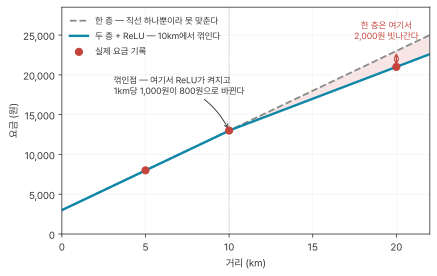

## 요금표를 모른 채 요금을 알아내기

택시를 세 번 탔다. 요금표는 못 봤고 거리와 낸 돈만 적어놨다.

```
 2 km  →   5,000원
 5 km  →   8,000원
10 km  →  13,000원
```

12km를 가면 얼마가 나올까. 요금표가 없으니 이 세 줄에서 규칙을 뽑아내야 한다.

가장 먼저 떠오르는 방법은 나누기다. 2km에 5,000원이니 1km에 2,500원, 그러면 12km는 30,000원.

이 규칙을 나머지 두 줄에 넣어보면 어긋난다.

```
        이 규칙       실제 기록      차이
 2 km    5,000원      5,000원        0
 5 km   12,500원      8,000원     -4,500원
10 km   25,000원     13,000원    -12,000원
```

깎이는 금액이 4,500원과 12,000원으로 다르고 비율로 봐도 36%와 48%라 일정하지 않다. 할인 같은 것으로는 설명되지 않는다.

### 줄과 줄 사이를 보면 다른 답이 나온다

한 줄 전체를 거리로 나누는 대신, 줄이 바뀔 때 무엇이 얼마나 변했는지만 떼어놓고 본다.

```
 2 km →  5 km :  거리 +3 km,  요금 +3,000원
 5 km → 10 km :  거리 +5 km,  요금 +5,000원
```

둘 다 1km당 1,000원이다. 처음 계산한 2,500원이 아니다.

그러면 2km를 갔을 때 거리에 붙는 요금은 2,000원이어야 하는데 실제로는 5,000원을 냈다. 3,000원이 남는다. 이 3,000원은 거리를 아무리 줄여도 없어지지 않는 돈, 즉 기본요금이다.

```
요금 = 3,000원 + 1,000원 × 거리
```

세 줄이 모두 맞는다. 12km면 15,000원이다.

### 값이 아니라 개수가 모자랐다

규칙의 모양을 보면 사람이 정할 수 있는 값이 두 자리다.

```
요금 =  [ 3,000 ]  +  [ 1,000 ] × 거리
```

이 두 값의 정식 이름이 [파라미터](../glossary.qmd#parameter)(parameter)다. 둘은 역할이 달라서 이름이 따로 있다.

| 자리 | 정식 용어 | 하는 일 |
|---|---|---|
| 1,000 | **가중치** (weight) | 입력에 곱해져서 그 입력이 결과에 얼마나 반영될지 정한다 |
| 3,000 | **편향** (bias) | 아무것에도 곱하지 않고 그냥 더해진다 |

처음에 만든 규칙은 파라미터가 하나였다. `요금 = 2,500 × 거리`. 이 모양에서는 2,500을 어떤 숫자로 바꿔도 세 줄을 동시에 맞출 수 없다. **파라미터 값이 틀린 게 아니라 개수가 모자랐다.**

여기서 층이 둘로 갈린다.

```
규칙의 모양 (파라미터 몇 개, 어떻게 배선하나)  →  사람이 설계한다
그 파라미터에 들어갈 값                       →  학습이 정한다
```

## 기계는 이 값을 어떻게 찾나

방금은 사람이 머리로 찾았다. 줄 사이 차이를 보자는 요령을 떠올렸고 거기서 1,000원을 뽑았다. 기계는 그런 요령을 생각해내지 못한다. 할 줄 아는 것은 숫자를 넣고 계산하는 일뿐이다.

가장 단순한 방법은 다 해보는 것이다. 파라미터 두 개를 0원부터 10,000원까지 1원 단위로 전부 대입하면 1억 가지다. 컴퓨터에게 1억 번은 순식간이다.

문제는 파라미터가 늘어날 때다.

```
파라미터 2개  →  1억 가지
파라미터 3개  →  1조 가지
파라미터 4개  →  1경 가지
```

파라미터 하나가 늘 때마다 경우의 수가 만 배씩 늘어난다. 트랜스포머 논문의 작은 모델은 파라미터가 6,500만 개다.

그래서 실제 방법은 다르다. 아무 값이나 넣어놓고 틀린 만큼 고쳐 나간다.

### 틀린 정도를 숫자로

기계가 파라미터를 아무렇게나 놓았다고 하자.

```
요금 = [0원] + [2,500원] × 거리
```

이 기계는 정답 요금표를 본 적이 없다. 손에 있는 것은 기록 세 줄뿐이다. 그런데 그 세 줄만으로도 자기가 틀렸다는 것을 알 수 있다. 자기 답과 실제 기록을 비교하면 된다.

```
      차이        제곱
 2km      0  →            0
 5km  4,500  →   20,250,000
10km 12,000  →  144,000,000
                ─────────────
                164,250,000
```

차이를 제곱해서 모두 더한 값이 이 기계의 [손실](../glossary.qmd#loss)(loss)이다. 제곱하는 이유는 그냥 더하면 `+4,500`과 `-4,500`이 서로 지워져서 오차가 없는 것처럼 보이기 때문이다. 왜 하필 제곱이고 절댓값이 아닌지에는 더 깊은 이유가 있지만 트랜스포머 논문을 읽는 데는 필요하지 않기 때문에 일단 넘어간다.

정답 파라미터인 편향 3,000과 가중치 1,000을 넣으면 손실이 0이다. 그러니 값을 찾는 일은 이렇게 바꿔 쓸 수 있다.

> 파라미터를 조절해서 손실을 가장 작게 만드는 일.

이 일의 이름이 [학습](../glossary.qmd#training-inference)이다. 사람이 정답 파라미터를 알려주는 것이 아니라 기계가 자기 답과 기록의 차이만 보고 값을 고쳐 나간다.

### 경사하강법

손실이 1억 6천만이라는 것을 알아도 그것만으로는 편향을 올릴지 내릴지 알 수 없다. 방향을 못 찾으면 결국 다 해보기로 돌아간다.

파라미터 두 개를 한 쌍으로 놓고 보면 상황이 정리된다. 값을 정하면 요금표가 하나 정해지고 그 요금표가 얼마나 틀렸는지도 하나로 정해진다.

| 편향 | 가중치 | 이 요금표가 내는 답 | 손실 |
|---|---|---|---|
| 0 | 2,500 | 5,000 / 12,500 / 25,000 | 164,250,000 ← 지금 |
| 100 | 2,500 | 5,100 / 12,600 / 25,100 | 167,580,000 |
| 0 | 2,000 | 4,000 / 10,000 / 20,000 | 54,000,000 |
| 3,000 | 1,000 | 5,000 / 8,000 / 13,000 | 0 ← 정답 |

실제 기록은 5,000 / 8,000 / 13,000이다. 기계가 움직인다는 것은 이 표에서 다른 줄로 옮겨간다는 뜻이고, 기록은 주어진 것이라 움직이지 않는다.

한 가지 방법은 아무 방향으로나 조금 움직여보고 손실이 줄어들면 그쪽으로 계속 가는 것이다. 실제로 작동한다. 다만 파라미터 하나를 시험할 때마다 손실을 처음부터 다시 계산해야 한다. 파라미터가 6,500만 개면 한 걸음 딛는 데만 6,500만 번이다.

[경사하강법](../glossary.qmd#gradient-descent)(gradient descent)도 손실이 줄어드는 쪽으로 간다. 목적지는 같고 다른 것은 방향을 알아내는 방법이다. 움직여보고 확인하는 대신 식에서 읽어낸다.

읽어낼 수 있는 이유는 규칙의 모양을 우리가 정했기 때문이다.

```
요금 = 편향 + 가중치 × 거리
```

편향을 100 올리면 답이 100 오른다. 가중치를 100 올리면 거리만큼 곱해지니 10km 손님에게는 1,000이 오른다. 해보지 않아도 식에서 나온다. 파라미터마다 손실에 미치는 영향이 딴판인 이유가 이것이다.

지금 위치에서 각각 1원씩 올렸을 때 손실이 움직이는 폭이다.

```
편향을 1 올리면    →  손실이   33,003 늘어난다
가중치를 1 올리면  →  손실이  285,129 늘어난다   (약 8.6배)
```

올렸을 때 늘어난다는 것을 알면 내려야 한다는 것도 같이 안 것이다. 반대쪽을 따로 시험할 필요가 없다. 이 값 하나가 크기와 방향을 함께 준다.

각 파라미터가 손실을 어느 쪽으로 얼마나 흔드는지를 모아놓은 목록이 기울기(gradient)다. 그 기울기를 보고 손실이 낮은 쪽으로 내려가기 때문에 경사하강법이라 부른다. 핵심은 이 목록이 계산 한 번에 통째로 나온다는 점이다.

```
파라미터 6,500만 개일 때

  움직여보는 방식   손실 계산 6,500만 번
  경사하강법        손실 계산 1번  →  6,500만 개가 한꺼번에
```

파라미터가 두 개면 두 방식의 차이가 거의 없다. 6,500만 개가 되면 앞쪽은 쓸 수 없고 뒤쪽만 남는다.

기울기를 한 번에 얻어내는 계산 방식(역전파, backpropagation)과 한 걸음을 얼마나 크게 딛는지(학습률, learning rate)는 여기서 다루지 않는다. 트랜스포머 논문을 읽는 데 필요한 것은 한 문장이다.

**"학습으로 정해진다"는 말은 파라미터를 손실이 줄어드는 쪽으로 조금씩 옮긴다는 뜻이다.**

### 정리하면 다섯 줄

```
1. 규칙의 모양을 정한다              →  사람이 한다
2. 파라미터에 아무 값이나 넣는다      →  보통 무작위
3. 손실을 계산한다                   →  기계의 답 vs 실제, 차이를 제곱해 합
4. 파라미터를 줄어드는 쪽으로 옮긴다  →  경사하강법
5. 3~4를 수없이 반복한다
```

파라미터가 두 개든 6,500만 개든 절차는 같다. 그리고 트랜스포머 논문의 저자들이 새로 한 일은 1번이다. attention이니 query·key·value니 하는 것은 전부 사람이 설계한 배선이고 학습은 그 배선에 달린 파라미터 값만 정한다.

지금까지 만든 이 기계는 아직 [신경망](../glossary.qmd#neural-network)이 아니다. 학습은 파라미터를 옮기는 절차이고 신경망은 그 파라미터가 붙어 있는 계산식의 구조라 서로 다른 층의 얘기다. 요금표 하나짜리 기계도 학습을 한다. 신경망은 이 계산을 여러 층 쌓은 형태이고 왜 쌓아야 하는지는 뒤에서 본다.

## 단어를 숫자로

택시 예에서 기계에 넣은 입력은 숫자 하나였다. 거리 2, 5, 10. 그런데 넣고 싶은 것은 단어다. 기계는 숫자만 먹으니 "사과"를 숫자로 바꿔야 한다.

가장 단순한 방법은 사전 순서대로 번호를 매기는 것이다.

```
바나나  →  1
비행기  →  2
사과    →  3
자동차  →  4
```

단어가 숫자가 됐으니 기계에 넣을 수는 있다. 그런데 이 숫자들로 계산을 하면 뜻과 무관한 결과가 나온다.

```
바나나 1 ─ 비행기 2      숫자로 이웃
바나나 1 ─── 사과 3      숫자로 더 멂
```

뜻으로는 바나나와 사과가 가까운데 숫자로는 바나나와 비행기가 가깝다. 사전 순서는 뜻과 아무 상관이 없기 때문이다. 숫자를 두 차원으로 늘려서 `바나나 = [0,1]`, `비행기 = [0,2]`로 만들어도 나아지지 않는다. **문제는 숫자가 몇 차원이냐가 아니라 그 숫자가 무엇을 나타내느냐다.**

### 뜻이 가까우면 숫자도 가깝게

그러면 사전 순서 말고 뜻에 따라 배치해보면 된다. 아래 숫자는 설명을 위해 임의로 고른 값이다.

```
사과 1    바나나 2  ·····공백·····  자동차 8    비행기 9
└── 먹는 것 ──┘                    └── 타는 것 ──┘
```

과일끼리 가깝고 탈것끼리 가깝다. 여기에 "포도"를 넣으면 1.5쯤, "트럭"을 넣으면 8.5쯤이면 된다.

그런데 "노랑"은 놓을 자리가 없다. 바나나는 노랗기 때문에 2 근처여야 하고 택시도 노랗기 때문에 8 근처여야 한다. 한 숫자가 두 곳에 동시에 있을 수 없다.

이유는 지금 쓴 숫자 하나가 "먹는 것 ↔ 타는 것"이라는 차원 하나이기 때문이다. 단어 사이의 관계가 그 하나로 담기지 않는다.

```
차원 1:  먹는 것  ↔  타는 것
차원 2:  노랑     ↔  빨강    ↔ …
차원 3:  작다     ↔  크다
차원 4:  빠르다   ↔  느리다
        …
```

차원이 하나면 관계 한 종류밖에 담지 못한다. 그래서 단어 하나에 숫자를 여러 개 준다. 차원이 여러 개인 좌표가 되는 셈이다.

```
바나나  →  [ 2.0,  9.0,  1.0, … ]
             먹는것  노랑   작다
```

이 벡터가 [임베딩](../glossary.qmd#embedding)(embedding)이고 트랜스포머 논문에서는 512개다. 실제 모델의 각 차원이 위처럼 이름 붙은 뜻을 하나씩 맡는 것은 아니지만, 차원 여러 개가 있어야 여러 관계를 담을 수 있다는 구조는 같다.

### 이 숫자는 누가 정하나

단어가 수만 개이고 차원이 수백 개다. 사람이 앉아서 "바나나의 노랑 차원은 9.0" 하고 채울 수 있는 양이 아니다.

앞의 다섯 줄을 그대로 쓰면 된다. 이 숫자들도 파라미터이고 학습으로 정해진다. 다만 학습을 하려면 손실을 계산해야 하고 손실을 계산하려면 정답이 있어야 한다. 택시에서는 실제로 낸 요금이 정답이었다. "바나나의 노랑 차원은 9.0이 정답"이라고 적힌 표는 세상에 없다.

정답지는 다른 데서 나온다. 인터넷에 있는 글에서 문장 하나를 가져온다.

```
나는 아침에 바나나를 먹었다.
```

여기서 한 단어를 가린다.

```
나는 아침에 [ ??? ]를 먹었다.
```

기계에게 빈칸을 맞히라고 시킨다. 그리고 정답은 이미 알고 있다. 방금 가린 그 단어다.

```
기계의 답:  "자동차"     ← 처음엔 아무 값에서 출발하니 아무거나 나온다
정답     :  "바나나"
             ↓
          손실이 크다  →  파라미터를 조절한다
```

사람이 정답지를 만들 필요가 없다. 글이 이미 정답을 갖고 있고 가리기만 하면 된다. 인터넷에 있는 모든 문장이 문제집이 된다.

### 빈칸 맞히기가 뜻을 만드는 과정

이걸 수없이 반복하면 단어들의 좌표가 특정한 방향으로 밀린다.

```
"아침에 ___를 먹었다"      →  바나나 O   사과 O   자동차 X
"___가 익어서 노랗다"      →  바나나 O   사과 △   자동차 X
"___를 타고 출근했다"      →  바나나 X   사과 X   자동차 O
```

바나나와 자동차의 좌표를 비슷하게 두면 기계 눈에 둘은 거의 같은 단어가 된다. 그러면 첫 줄 빈칸에 자동차를 넣게 되고 틀린다. 손실이 커진다.

바나나와 사과는 사정이 다르다. 두 단어는 같은 빈칸에 둘 다 들어간다. 그러니 좌표를 가깝게 둬도 틀릴 일이 없다.

오히려 이득이 있다. 좌표가 가까우면 기계는 둘을 한 덩어리로 다루게 되고, 바나나로 배운 것이 사과에도 적용된다. 사과가 드물게 나오는 단어여도 빈칸을 더 잘 맞히게 된다. 손실이 줄어든다.

> 같은 자리에 나오는 단어끼리는 좌표가 모이고 다른 자리에 나오는 단어끼리는 벌어진다. 손실을 줄이려면 그렇게 될 수밖에 없다.

**아무도 "바나나는 과일이다"라고 알려준 적이 없다.** 빈칸 맞히기만 시켰는데 좌표가 뜻을 담게 된다. 지금 쓰는 대형 언어모델은 이것을 조금 바꿔서 다음 단어 맞히기로 훈련한다. 원리는 같다.

## 512개를 64개로 바꾸는 행렬

트랜스포머 논문에 이런 문장이 있다.

> we found it beneficial to linearly project the queries, keys and values h times with different, learned linear projections to d_k, d_k and d_v dimensions
>
> query·key·value를 서로 다른 학습된 선형 투영으로 h번 투영해 각각 d_k, d_k, d_v 차원으로 보내는 것이 유리하다는 것을 발견했다

여기서 "선형 투영"이 512개짜리 벡터를 64개짜리로 바꾸는 계산이다(`d_k`와 `d_v`가 바뀐 뒤의 개수이고 이 논문에서는 둘 다 64다). 이 계산이 무엇인지를 택시 예시로 돌아가서 세운다.

지금까지 요금은 거리 하나로만 정해졌다. 실제 택시는 심야 할증이 붙고 막히면 대기 시간만큼 요금이 올라간다. 입력을 셋으로 늘리면 규칙이 이렇게 된다.

```
요금 = 3,000 + 1,000×거리 + 200×대기시간 + 2,000×심야여부
```

심야여부는 심야면 1, 아니면 0이다. 총 파라미터는 4개다. 입력이 하나 늘 때마다 가중치가 하나 는다.

여기서 식에 든 숫자를 두 종류로 갈라야 한다.

```
요금 = 3,000 + 1,000×거리 + 200×대기 + 2,000×심야
       ─────   ─────      ───       ─────
       파라미터 4개 — 손님이 바뀌어도 그대로다. 학습이 정한다

                     ──       ──          ──
                     입력 3개 — 손님마다 매번 바뀐다
```

### 출력이 여러 개면 표가 된다

같은 정보로 요금만 계산하는 게 아니라 도착 시간까지 함께 내놓는다고 하자. 파라미터를 나눠 쓸 수는 없다. 거리 1km가 요금은 1,000원 올리지만 도착 시간은 3분 올리기 때문이다. 같은 입력에 곱하는 값이 다르니 출력마다 자기 가중치를 따로 가진다.

```
요금     = 3,000 + 1,000×거리 + 200×대기 + 2,000×심야
도착시간 =     5 +     3×거리 +   1×대기 +     0×심야
```

가중치만 떼어 종이에 적으면 표가 나온다. 들어오는 쪽을 가로줄에, 나가는 쪽을 세로줄에 놓는다.

```
          요금    도착시간      ← 열(세로줄) = 나가는 쪽
거리     1,000        3
대기       200        1
심야     2,000        0
  ↑
행(가로줄) = 들어오는 쪽
```

이 표가 행렬(matrix)이다. 위의 식 두 줄에서 가중치만 뽑아 정리한 것이다. 열 하나를 세로로 읽으면 그 출력을 만드는 계산식이 그대로 나온다.

여기서 눈에 걸리는 칸이 하나 있다. 도착시간 열의 심야 칸이 `0`이다. 밤이든 낮이든 20km 가는 데 걸리는 시간은 같다는 뜻이다. **이 0도 사람이 넣은 값이 아니라 학습이 찾아낸 값이다.** 영향이 없다는 사실 자체가 데이터를 맞추다 보니 그 칸이 0으로 내려앉은 결과다.

### 입력이 512개일 때

택시에서는 손님 한 명이 숫자 3개였다. 트랜스포머에서는 단어 하나가 숫자 512개다. 앞에서 만든 임베딩이 그것이다.

```
택시 손님 하나  →  입력   3개  :  거리 10, 대기 5, 심야 0
단어 "its"      →  입력 512개  :  [ 0.2, 0.5, 0.1, … ]
```

입력이 3개에서 512개로 늘었으니 표의 가로줄도 512개가 된다. 세로줄은 출력 개수만큼이니 64개다.

```
입력   3개  →  출력  2개  :  행렬    3 × 2,    칸      6개
입력 512개  →  출력 64개  :  행렬  512 × 64,  칸 32,768개
```

읽는 법은 바뀌지 않는다. 열 하나가 출력 하나를 만들고 그 열에는 입력마다 곱할 가중치가 하나씩 적혀 있다. 도착시간 열에 `3 · 1 · 0` 세 개가 적혀 있었듯이 512 × 64 표의 첫 열에는 가중치가 512개 적혀 있다.

그 512개를 각각 곱해서 전부 더하면 숫자 하나가 나온다. 택시에서 세 개를 곱해 더해 도착시간 하나를 얻은 것과 같다. 곱셈은 512번 하지만 마지막에 전부 더하니 결과는 하나다.

```
[512개 좌표]  ──  1번 열의 가중치 512개를 곱해 더하기   ──→  숫자 1개
[512개 좌표]  ──  2번 열의 가중치 512개를 곱해 더하기   ──→  숫자 1개
      …                      …                              …
[512개 좌표]  ──  64번 열의 가중치 512개를 곱해 더하기  ──→  숫자 1개
                                                       ───────────
                                                            64개
```

**512개 중에서 쓸 만한 64개를 골라내는 것이 아니다.** 나온 64개는 전부 새로 계산된 값이고 원래 있던 숫자는 하나도 그대로 남지 않는다.

여기서 갈라둘 것이 있다. 칸 32,768개를 채우는 일과 그 칸을 써서 계산하는 일은 다르다.

| | 무엇을 하나 | 언제 |
|---|---|---|
| 학습 | 칸 32,768개에 들어갈 가중치 값을 정한다 | 훈련할 때 한 번. 끝나면 고정된다 |
| 계산 | 그 가중치로 512개를 곱해 더해 64개를 만든다 | 단어가 들어올 때마다 매번 |

훈련이 끝난 뒤에는 값이 안 변한다. 단어가 백만 개 들어와도 매번 일어나는 일은 곱하고 더하는 계산뿐이다.

논문이 query·key·value 세 방향으로 변환한다고 한 것은 이런 행렬을 세 개 두었다는 뜻이다. 셋 다 같은 512개를 받지만 가중치가 다르니 다른 64개가 나온다.

## 한 층으로는 못 푸는 규칙이 있다

이 택시 회사가 장거리 할인을 도입했다.

```
 5 km  →   8,000원
10 km  →  13,000원
20 km  →  21,000원
```

10km까지는 1km당 1,000원인데 10km를 넘으면 1km당 800원이다. 그래프가 10km에서 꺾인다.

`편향 + 가중치 × 거리` 형태로는 이 세 줄을 못 맞춘다. 직접 맞춰보면 드러난다.

```
앞의 두 줄로 맞추면   편향 3,000  가중치 1,000
   → 20km 예측 23,000원   (실제 21,000)  ✗

뒤의 두 줄로 맞추면   편향 5,000  가중치   800
   →  5km 예측  9,000원   (실제  8,000)  ✗
```

**어떤 값을 넣어도 세 줄을 동시에 맞출 수 없다.** 가중치를 더 붙여도 소용없다. `편향 + A×거리 + B×거리`는 `편향 + (A+B)×거리`로 합쳐져 여전히 같은 모양이다. 개수의 문제가 아니라 모양의 한계다.

곱셈과 덧셈만으로 이루어진 계산에는 이름이 있다. 선형(linear)이다. 뺄셈과 나눗셈도 여기 들어간다. `÷2`는 `×0.5`와 완전히 같기 때문이다. 선형 계산의 결과는 그래프로 그리면 언제나 곧은 직선이다.

### 층을 쌓아도 그대로다

그러면 행렬을 두 층 쌓으면 어떨까. 첫 행렬의 출력을 두 번째 행렬의 입력으로 넣는 것이다. 파라미터가 두 배로 늘어나니 더 복잡한 규칙을 담을 수 있을 것 같다.

층과 층 사이를 흐르는 값에도 이름이 있다. 활성값(activation)이다. 요금도 아니고 거리도 아닌, 계산 도중에 잠깐 생겼다 사라지는 숫자다.

```
층 1 :  활성값 = 2 × 거리 + 1
층 2 :  요금   = 3 × 활성값 + 5
```

10km 손님으로 굴려보면 이렇다.

```
거리 10  →  [층 1]  2×10+1 = 21  →  [층 2]  3×21+5 = 68
                             ↑
                           활성값
```

그런데 한 층짜리로도 똑같은 답이 나온다.

```
          두 층                         한 층
거리  5   11 → 38                  6× 5 + 8 =  38
거리 10   21 → 68                  6×10 + 8 =  68
거리 20   41 → 128                 6×20 + 8 = 128
```

식으로 풀어도 그렇다.

```
3 × (2×거리 + 1) + 5  =  6×거리 + 3 + 5  =  6×거리 + 8
```

괄호가 풀려서 그냥 합쳐진다. 활성값 21은 계산 도중에 잠깐 생겼다가 최종 식에서는 흔적도 없이 사라진다.

**층을 천 개 쌓아도, 행렬을 512 × 512로 키워도 마찬가지다.** 파라미터와 계산량만 늘고 표현할 수 있는 규칙의 종류는 그대로다. 선형끼리는 아무리 겹쳐도 선형이기 때문이다.

### 그래서 사이에 활성화 함수가 들어간다

필요한 것은 선형이 아닌 것, 즉 비선형(non-linear)이다. 층과 층 사이에 끼워 비선형을 만드는 함수를 활성화 함수(activation function)라 부르고, 가장 널리 쓰이는 것이 ReLU다.

하는 일은 한 줄이다.

```
ReLU(-3) = 0      음수가 들어오면 0
ReLU( 0) = 0
ReLU( 5) = 5      양수면 그대로
```

0과 비교해서 큰 쪽을 고르는 것이고 사칙연산이 아니다. 수식으로는 `max(0, x)`로 쓴다. 곱셈도 덧셈도 아니라서 괄호를 풀어 합칠 수가 없다.

```
선형만        :  3 × (2x + 1) + 5       →  괄호를 푼다     →  6x + 8
ReLU를 끼우면 :  3 × ReLU(2x − 15) + 5  →  괄호를 못 푼다
```

`ReLU(…)` 안에 든 것을 밖으로 꺼낼 방법이 없다. 안의 값이 음수인지 양수인지에 따라 결과가 갈리는데 그건 `x`가 얼마인지 알기 전에는 정할 수 없기 때문이다. 그래서 두 행렬이 하나로 합쳐지지 않고 각자 살아남는다.

### 꺾인 요금표를 실제로 만들면

앞에서 한 층으로 못 맞춘 그 요금표를 두 층으로 만들어본다.

```
[층 1]   거리 하나에서 활성값 두 개를 뽑는다
           활성값 A = 1,000 × 거리
           활성값 B =     1 × 거리 − 10

[ReLU]   음수면 0으로 바꾼다

[층 2]   요금 = 3,000 + A − 200 × ReLU(B)
```

돌려보면 세 줄이 전부 맞는다.

```
거리  5   A= 5,000  B= −5  →  ReLU(B)= 0   요금 = 3,000+ 5,000−    0 =  8,000  ✓
거리 10   A=10,000  B=  0  →  ReLU(B)= 0   요금 = 3,000+10,000−    0 = 13,000  ✓
거리 20   A=20,000  B= 10  →  ReLU(B)=10   요금 = 3,000+20,000−2,000 = 21,000  ✓
```

{fig-alt="거리 대 요금 그래프. 회색 점선은 한 층짜리 직선이고 청록 실선은 10km에서 꺾이고 실제 요금 기록 세 점은 청록 선 위에만 놓인다"}

활성값 B가 "10km를 넘었는가"를 재는 값이다. 10km 이하면 음수라 ReLU가 0으로 눌러버리고, 넘으면 넘은 만큼 살아남는다.

```
10km 이하:  ReLU(B) = 0   →  할인 항이 통째로 사라진다  →  1km당 1,000원
10km 초과:  ReLU(B) > 0   →  할인 항이 켜진다          →  1km당   800원
```

**ReLU가 스위치처럼 항 하나를 켜고 끈다.** 그리고 켜지는 지점이 그래프가 꺾이는 자리다. 그 `10`이라는 숫자도 학습이 찾아낸 파라미터다. 어디서 꺾을지를 사람이 지정하지 않는다.

### 활성값 개수를 늘리는 이유

구간마다 직선이고 이음매에서 방향이 바뀌는 함수를 구간별 선형 함수(piecewise linear function)라 한다. 방금 만든 요금 규칙이 그것이고 방향이 바뀌는 지점을 꺾인점(kink)이라 부른다.

ReLU 하나가 꺾인점 하나를 만든다. 그리고 꺾인점 하나가 구간 하나를 더한다.

```
꺾인점 1개    →  구간 2개짜리 규칙
꺾인점 2개    →  구간 3개짜리 규칙
꺾인점이 많으면  →  복잡한 곡선도 직선 여럿을 이어 붙여 가깝게 흉내낼 수 있다
```

꺾인점은 활성값 하나당 하나씩 생긴다. 활성값이 512개면 꺾인점도 512개뿐이다. 그래서 중간에서 개수를 늘려놓는다.

트랜스포머 층 안의 "피드포워드 신경망"이 정확히 이 구조이고 정식 이름은 피드포워드 신경망(feed-forward network)이다.

```
512개 → [행렬 512×2048] → [ReLU] → [행렬 2048×512] → 512개
                             ↑
                      꺾인점 2048개
```

행렬 두 개와 활성화 함수 하나이고 파라미터는 약 210만 개다.

행렬과 활성화 함수를 번갈아 쌓은 이 구조 전체를 [신경망](../glossary.qmd#neural-network)(neural network)이라 부르고, 층을 깊게 쌓아 쓰는 방식을 딥러닝(deep learning)이라 한다. 행렬만 쌓으면 아무리 깊어도 직선 하나라는 것을 방금 봤으니, 활성화 함수가 빠지면 깊이에 의미가 없다.

## 이어서

트랜스포머 논문에는 여기서 세운 것을 이미 안다고 전제하고 넘어가는 자리가 넷 있다.

하나는 "학습으로 정해진다"가 나올 때마다다. 논문은 변환 행렬도 위치 벡터도 이 말로 넘어간다. 그 말이 파라미터를 손실이 줄어드는 쪽으로 옮기는 절차를 가리킨다는 것을 알면 그 자리에서 멈추지 않는다.

다른 하나는 단어끼리 비슷한 정도를 계산하는 대목이다. 그 계산은 두 단어의 좌표를 곱해서 더하는 것인데, 좌표가 아무 숫자였다면 그 결과에 아무 의미가 없다. 빈칸 맞히기로 다듬어진 좌표이기 때문에 **좌표가 가깝다는 것이 곧 비슷한 자리에 나온다는 뜻이고 그것이 뜻이 비슷하다는 뜻**이 된다.

셋째는 벡터를 query·key·value로 "변환한다"는 대목이다. 그것은 가중치를 행렬로 정리해두고 입력에 가중치를 곱해 더하는 계산이다. 행렬이 셋인 이유는 같은 입력에 서로 다른 가중치를 곱해 다른 결과를 얻으려는 것이다.

넷째는 층 안에 있는 "피드포워드 신경망"이다. 512차원을 2048로 늘렸다가 다시 512로 줄인다고만 적혀 있는데 그 안이 행렬 두 개 사이에 활성화 함수를 끼운 구조다. 늘렸다 줄이는 것이 낭비처럼 보이지만 꺾인점을 2048개 만들기 위한 자리이고 활성화 함수를 빼면 두 행렬이 하나로 합쳐져 층을 쌓은 의미가 사라진다.

그다음은 [attention만 남기고 다 걷어냈다](1706.03762-attention-is-all-you-need.qmd)로 이어진다.
